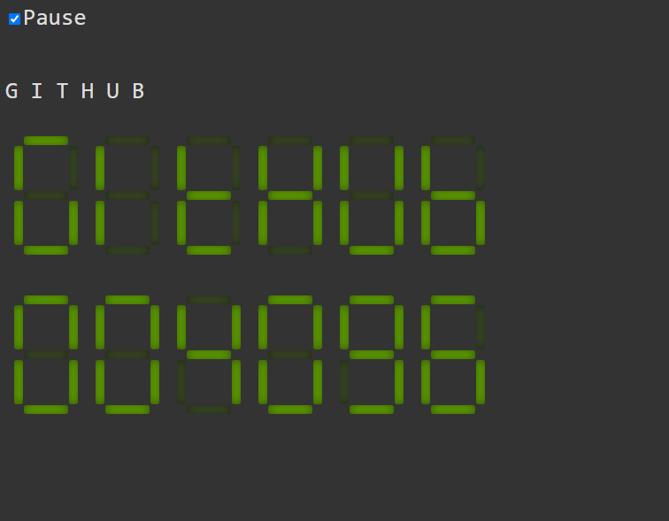

# sevensegment
Classic 7 segment LCD simulated with just HTML and CSS.

Few lines of JavaScript code is just there to change the class values dynamically to implement a text scroller and a counter.

Fun little code for education purposes.

